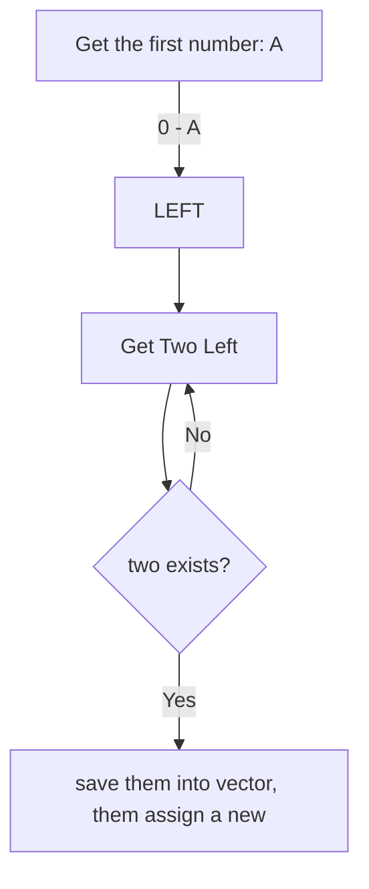

### 15. 3Sum

UNIQUE???

<b>Alright!</b>

1. a + b + c = 0 means, at least one of them is nagetive number!
2. find all negative numbers, and try whether they can be represented by two other numbers. 
3. How to avoid duplicate?